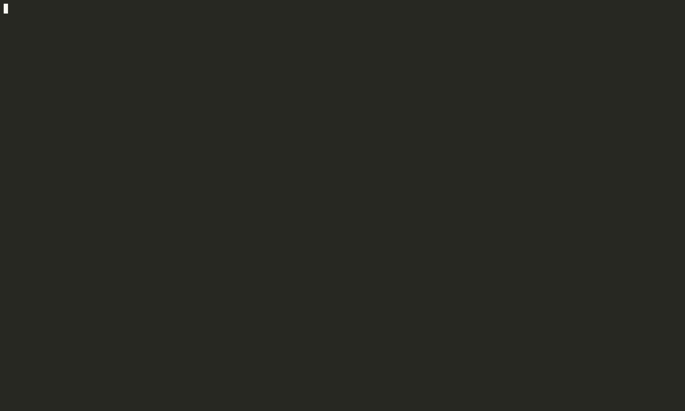

# share.nvim



## Setup

```lua
use({
  "morten-olsen/share.nvim",
  requires = {
    {'nvim-lua/plenary.nvim'},
    {'nvim-telescope/telescope.nvim'}
  },
  config = function()
    local share = require("share")
    local slack = require("share.providers.slack")
    share.config({
      providers = {
        my_slack = slack("your-slack-token")
      }
    })
  end
})
```

## Usage

```vim
" share as markdown
vnoremap <Leader>ss :!lua require("share").share("my_slack")

" share as code block 
vnoremap <Leader>ssm :!lua require("share").share("my_slack", { format: "code" })

```
